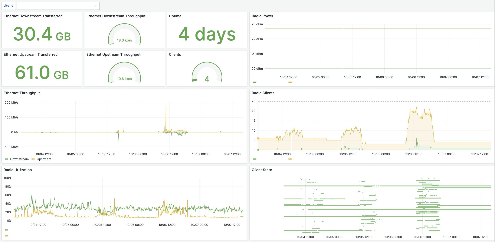

# ion-exporter

Prometheus exporter for [Aruba Instant On](https://www.arubainstanton.com) devices.



## Usage

```bash
docker run \
  --env ION_USERNAME="user@example.org" \
  --env ION_PASSWORD="password" \
  --publish 8000:8000 \
  ghcr.io/maxmouchet/ion-exporter:main
```

```bash
curl localhost:8000
# # HELP client_connection_duration_seconds_total client_connection_duration_seconds_total
# # TYPE client_connection_duration_seconds_total counter
# client_connection_duration_seconds_total{client_id="...",radio_id="...",site_id="..."} 577.0
# client_connection_duration_seconds_total{client_id="...",radio_id="...",site_id="..."} 1176.0
# ...
```

## Settings

See [`ion_exporter/settings.py`](ion_exporter/settings.py).
